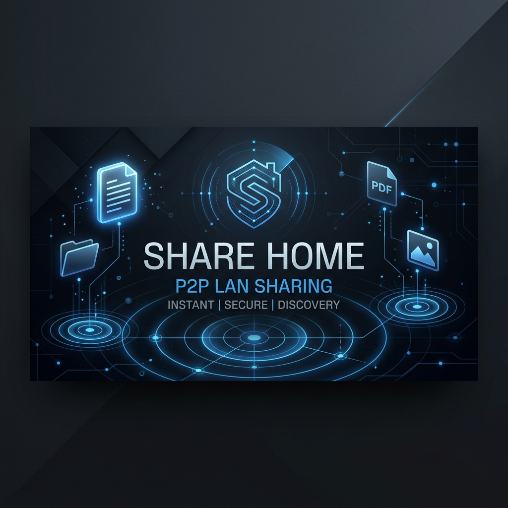
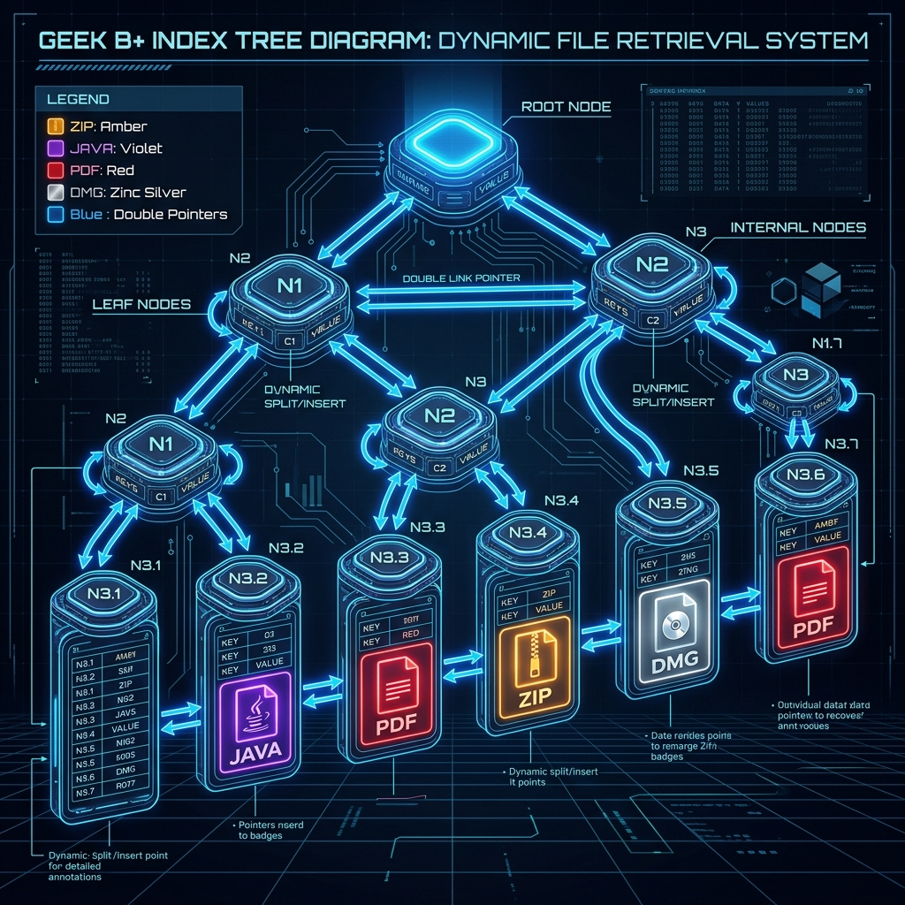

# 🏠 Share Home (局域网极客协作平台)

<p align="center">
  
</p>

<p align="center">
  <strong>去中心化 • 私密极速 • 零配置 • 算法驱动</strong>
</p>

<p align="center">
  <a href="https://github.com/18755120710/Share-Home/blob/master/LICENSE"></a>
  
  
  
</p>

---

**Share Home** 是一款专为局域网（LAN）团队打造的**去中心化、私密极速、零配置**的高端协作网盘与知识库平台。

平台融合了极速点对点大文件闪传收发、大厂级 B+ 树索引关系驱动的“飞书式”分布式云文档协作系统，并全面接入前沿的 **Zinc 中性冷灰视觉规范**与自适应**蔚蓝色高亮色彩系统**。为团队局域网协作带来极致高效、安全性与惊艳的科技美学体验。

---

## ✨ 核心特性与重磅升级

### 1. 📂 闪电文件投递舱 (File Transfer Hub)
- **物理带宽投递**：支持局域网内任意体积大文件、文件夹的极速无损传输，不经过外网服务器，速度仅受限于您的物理网络带宽。
- **雷达自发现 (mDNS)**：基于 Multicast DNS (多播 DNS) 协议，开启平台即可**自动雷达捕获**同一局域网内所有在线节点，无需手动繁琐配置 IP。
- **物理路径自愈**：传输文件的物理落盘目录支持在系统配置中动态修改，后端自动完成写权限预检防灾测试。

### 2. 🌲 极客 B+ 树配置驱动云文档 (B+ Index Knowledge Base) `重磅升级`
我们将云文档系统由传统的“小文件全盘扫描”重构为**大厂数据库级 B+ 树关系驱动架构**：

<p align="center">
  
</p>

> [!TIP]
> **算法重塑带来的四大核心技术突破：**
> * **列表 0ms 闪电响应**：引入了 `cacheDocs` 极速内存二级缓存，文档列表拉取瞬间响应，**完全省去了频繁扫描磁盘目录、逐个打开并反序列化上百个独立 Markdown 物理文件的巨大磁盘 I/O 开销**！
> * **文件夹无落盘物理净化**：新建文件夹仅写入内存和 `meta.json` 索引配置文件，**物理磁盘上完全不产生任何空 `.md` 假文件**，物理磁盘清爽干净 100%。
> * **B+ 树双向兄弟链表缝合**：内存中的多叉树在数据变动时会自动启动拓扑自愈，为同级子项自动缝合前驱 (`prevSiblingId`) 与后继 (`nextSiblingId`) 兄弟指针，实现 $O(1)$ 时间极速前后文导航。
> * **防环路智能移树与批量剪枝**：在拖拽移动文件夹修改其父子归属时，利用物化路径在 $O(1)$ 时间内精准拦截环路死锁（防止将父文件夹移入自己子孙下），并对子孙树进行级联路径刷新；删除文件夹时，利用物化路径前缀一次性匹配批量删除磁盘文件，免去昂贵的磁盘递归。

### 3. 🎨 蔚蓝主题升级 & 多态大写后缀名徽章 `UI/UX 升级`
我们对公共共享中心进行了全方位的色彩净化和视觉重塑，退场了原本突兀的蓝紫杂色，全面拥抱蔚蓝色高光。

> [!NOTE]
> * **色彩系统大一统**：去除了硬编码的 Indigo (蓝紫)、Purple (紫色) 等杂色，全面适配系统原生的蔚蓝色变量 `var(--accent-color)`，界面质感更加高端、统一。
> * **多态后缀名极客徽章**：针对网格卡片中类似 `.java`、`.dmg`、`.zip`、`.pdf` 等无法在线直接预览的文件类型，原本显示的灰色单一文档图标已被**多态大写后缀名徽章系统**完全接管。系统会自动转换并渲染大写等宽字体（如 `JAVA` / `DMG`），并根据格式属性分发**大厂标志性色彩**与 **1px 微透磨砂描边**，视觉体验极为震撼。

---

## 🛠️ 技术栈

* **前端核心**：React 19, Next.js 16, TypeScript
* **视觉层**：Vanilla CSS (CSS Variables), Lucide Icons, Slate/Zinc UI Design
* **网络与发现**：WebSocket (ws), mDNS (bonjour-service), Fast IP Parser
* **渲染与高亮**：Prism.js (Tomorrow Dark Theme)
* **存储系统**：Node.js fs, path 物理流式文件系统, JSON-driven Indexing

---

## 🚀 快速启动

在开始之前，请确保本地已安装 [Node.js](https://nodejs.org/) 以及包管理器 [pnpm](https://pnpm.io/)。

### 1. 克隆并安装依赖
```bash
# 复制项目到本地
git clone https://github.com/18755120710/Share-Home.git
cd Share-Home

# 优先使用 pnpm 安装依赖
pnpm install
```

### 2. 启动开发服务器
```bash
pnpm dev
```
启动后，控制台将输出本端设备在局域网中的监听端口及 Web 访问地址。打开浏览器访问对应的 `http://localhost:3000` 或本地分配的 IP（如 `http://192.168.1.100:3000`）即可进入平台。

### 3. 系统参数持久化配置
项目在启动后，会在文档存储目录下自动生成一个 `meta.json` 隐藏索引参数文件用于记录 B+ 树拓扑，同时您的系统配置参数保存在 `config-settings.json` 中：
```json
{
  "storagePath": "./storage"
}
```
- **相对路径**：以 `./` 开头，将自动创建于项目根目录下。
- **绝对路径**：可以直接填写您本机的绝对物理目录路径（如 `/Users/username/MySharedFolder`）。

---

## 🌐 局域网协同要点

为了让多台设备相互发现并进行极速协同，请确保：
1. **网络同源**：所有协作设备均接入**同一局域网**（或连接到同一个 Wi-Fi）。
2. **放行网络端口**：本机防火墙已为 Node.js / Next.js 放行相应的 TCP **网络通信端口**（3000 用于 Web 访问，3001 用于 WebSocket 局域网广播）。
3. **首端广播 IP**：本项目 WebSocket 服务默认完美绑定在 `0.0.0.0` 地址，以彻底支持跨端自发现，请确保其他设备能正常 ping 通您的主机 IP。

---

## 📄 开源许可证

本项目基于 [MIT License](https://github.com/18755120710/Share-Home/blob/master/LICENSE) 协议开源。
